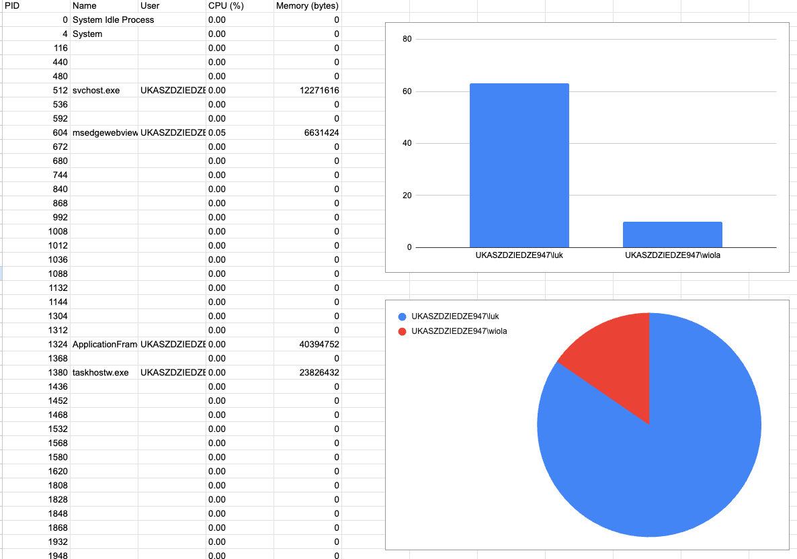

# Process Reporter

`process-reporter` is a lightweight, portable CLI tool that generates detailed reports of running processes on a running syste. It’s designed for ease of use, portability, and zero external dependencies.

---

## Features

- **Comprehensive Report Generation**
    - Lists all running processes
    - Includes: Process ID, name, user, CPU usage, and memory usage
    - Outputs: `JSON` and `CSV` formats

- **Highly Portable**
    - Runs as a single binary
    - No installation or runtime required
    - Can be executed from any directory (e.g., `Downloads`, `Documents`)

- **CI Integration**
  GitHub Actions pipeline included
  - [Tag-based releasing](.github/workflows/release.yml)
  - [Build and test PRs on multiple systems](.github/workflows/pr-build.yml)

---

## Supported Platforms

| OS      | Architecture |
|---------|--------------|
| Linux   | amd64, arm64 |
| macOS   | amd64, arm64 |
| Windows | amd64, arm64 |

---

## Installation

Download the latest release binary for your OS from the [releases page](https://github.com/ldziedziul/process-reporter-go/releases)
Place the binary in any folder and run it directly—no setup needed.

---

## Usage

Run the binary with `--help` to see available options:

```bash
process-reporter --help
Usage of process-reporter:
  -format string
        Output format: json or csv (default "json")
  -output string
        Optional output file name. If not set, output goes to stdout
```
> ℹ️ NOTE: options support also standard double dash `--` format, e.g. `--format json`

### Basic command to JSON report 

```bash
process-reporter --format json
```

Sample output:
```json
[
    {
    "pid": 10588,
    "name": "RuntimeBroker.exe",
    "user": "UKASZDZIEDZE947\\luk",
    "cpu_percent": 0.01,
    "mem_bytes": 12144640
  },
  {
  "pid": 10680,
  "name": "OpenConsole.exe",
  "user": "UKASZDZIEDZE947\\luk",
  "cpu_percent": 3.04,
  "mem_bytes": 12496896
  },
  {
  "pid": 10708,
  "name": "RuntimeBroker.exe",
  "user": "UKASZDZIEDZE947\\luk",
  "cpu_percent": 0.02,
  "mem_bytes": 30941184
  }
]
```

### Basic command to CSV report 

```bash
process-reporter --format csv
```

Sample output:
```csv
10588,RuntimeBroker.exe,UKASZDZIEDZE947\luk,0.01,12128256
10680,OpenConsole.exe,UKASZDZIEDZE947\luk,3.04,12496896
10708,RuntimeBroker.exe,UKASZDZIEDZE947\luk,0.02,30957568
```

---

# Visualizing Process Reports

This guide shows how to visualize `process-reporter` output using different tools

---

## 1. CSV with Google Sheets

### Step-by-Step:

1. Run the tool with CSV output:

   ```bash
   process-reporter --format csv --output report.csv
   ```

   This creates `report.csv`

2. Open in Google Sheets (`File > Import`)

  * Use built-in chart tools
  * Create:
    * Pie chart of processes with `PID` as a value and `User` as a label
    * Bar chart with `PID` as a value and `User` as a X-axis

Sample visualizations:

---

## 2. CLI quick summary

```bash
cut -d',' -f3 report.csv | tail -n +2 | sort | uniq -c | sort -nr
```
Output:
```
    106
     63 UKASZDZIEDZE947\luk
     10 UKASZDZIEDZE947\wiola
```

---

### Technology Evaluation

I evaluated three language/runtime options before selecting the final solution:

#### 1. **Java + GraalVM (Native Image)**

* Pros: 
  * Proficiency in Java,
  * Strong ecosystem, 
  * `OSHI` library for processes introspection.
* Cons: 
  * Complex native setup (JNA, build config), 
  * Native-image requires heavy configuration,
  * Build time.

#### 2. **Python + PyInstaller**

* Pros: 
  * quick prototyping, 
  * `psutil` module for processes introspection.
* Cons: 
  * PyInstaller require native system to build binaries for specific system  
  * PyInstaller builds are not truly portable on all Windows systems (DLL issues), 
  * User may need to install Python or Visual C++ redistributables.

#### 3. **Go**

* Pros:
  * Seamless cross-compilation
  * Compiles to true static binary
  * `gopsutil` library for processes introspection.
  * Output size and execution speed are optimal
  * Easy to integrate with CI/CD
* Cons
  * Need to learn Go basics

I evaluated **Java, Python, and Golang** for this task. Key drivers for the final decision included:

* **Portability:** Ability to run the tool from any location without relying on system-wide installations or dependencies.
* **Ease of Installation:** No complex setup or environment preparation needed.
* **No External Dependencies:** Avoid reliance on external libraries or runtimes.

**Golang** was selected for the following reasons:

* Compiles to a **single, static binary**.
* Easy access to system process info.
* Strong cross-platform capabilities.
* Easy distribution and execution.

> ⚠️ DISCLAIMER: This is my very first Go project. 
> I had to learn the basics of Go, including its standard library and idiomatic practices. The code may not be idiomatic or optimal, but it works.
---

### Key Learning takeaways

* **Single Binary Builds:** Using Go’s static compilation to create fully portable CLI binaries is trivial.
* **GraalVM native compilation**: Using java with GraalVM is not easy, requires deeper knowledge about dependencies and has its tradeoffs.
* **Golang Basics:** 
  * Learning Go's standard library for process management and JSON/CSV serialization.
  * Found Go as the optimal choice for **portable CLI tooling**.
* **Ansible on Windows**: doesn't work out of the box, need to enable WinRM or install ssh server.

---

### Deployment

For deployment details see [deployment/README.md](deployment/README.md).
